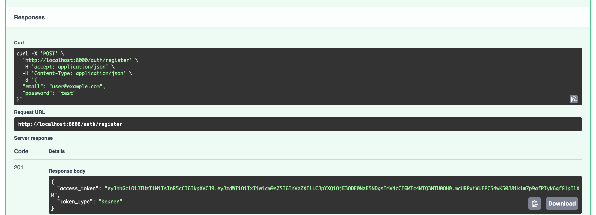
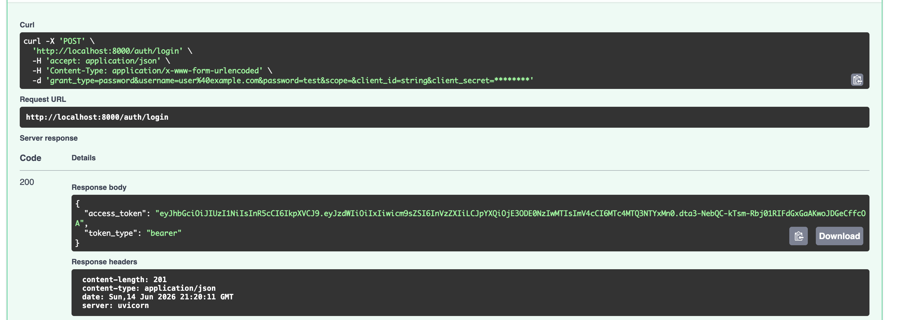
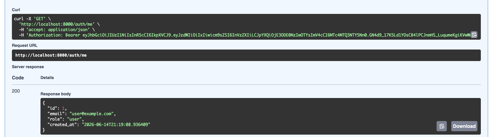
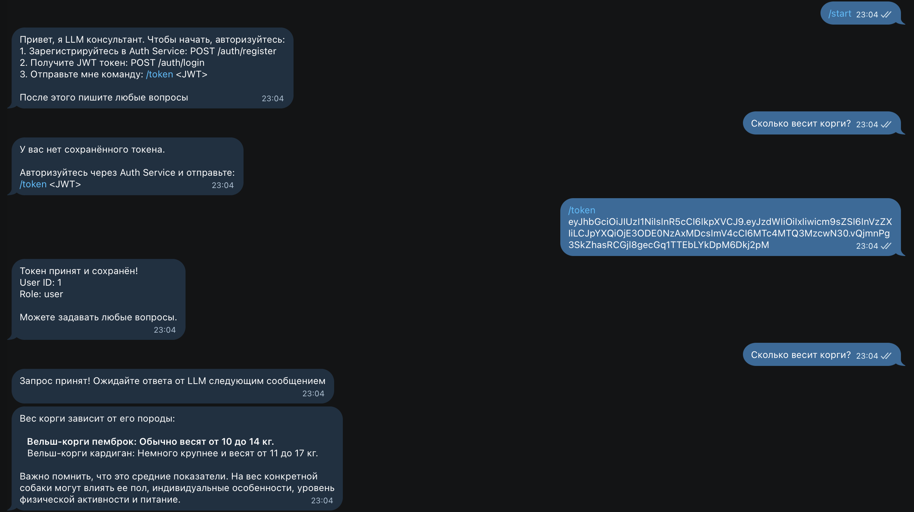
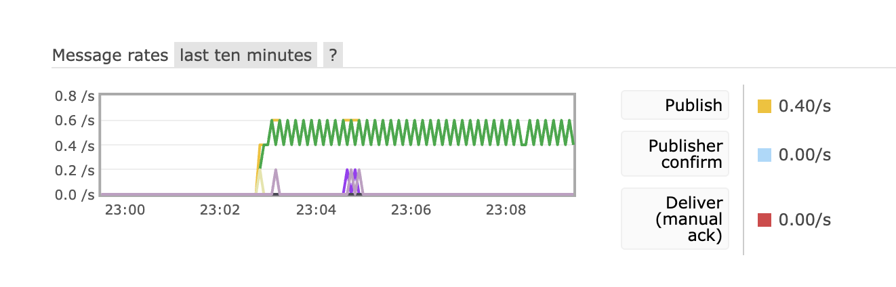

# Двухсервисная система LLM-консультаций

Распределённая система, состоящая из двух независимых сервисов: **Auth Service** (регистрация, авторизация, выпуск JWT) и **Bot Service** (Telegram-бот с LLM-консультациями). Архитектура построена по принципу разделения ответственности и приближена к реальным микросервисным системам.

## Архитектура

```
┌──────────────────┐     JWT      ┌───────────────────────────────────────┐
│                  │  ─────────►  │            Bot Service                │
│   Auth Service   │              │                                       │
│   (FastAPI)      │              │  ┌────────────┐    ┌──────────────┐   │
│                  │              │  │  Telegram  │───►│   RabbitMQ   │   │
│  • /auth/register│              │  │    Bot     │    │   (Broker)   │   │
│  • /auth/login   │              │  │ (aiogram)  │    └──────┬───────┘   │
│  • /auth/me      │              │  └────────────┘           │           │
│                  │              │                   ┌───────▼────────┐  │
│  SQLite + JWT    │              │                   │ Celery Worker  │  │
│                  │              │                   │   ┌──────────┐ │  │
└──────────────────┘              │                   │   │OpenRouter│ │  │
                                  │                   │   └──────────┘ │  │
                                  │                   └──────┬─────────┘  │
                                  │                   ┌──────▼────────┐   │
                                  │                   │    Redis      │   │
                                  │                   │(backend/cache)│   │
                                  │                   └───────────────┘   │
                                  └───────────────────────────────────────┘
```

### Ключевые принципы

- **Auth Service** — единственное место выпуска JWT-токенов и управления пользователями
- **Bot Service** — не знает о пользователях, паролях и механизмах регистрации; доверяет только корректно подписанному и не истёкшему JWT
- **RabbitMQ** — брокер задач Celery, обеспечивает асинхронную обработку LLM-запросов
- **Redis** — result backend Celery и хранилище JWT-токенов, привязанных к Telegram user_id
- **Celery Worker** — обрабатывает задачи LLM-запросов, вызывает OpenRouter и отправляет ответ пользователю

## Стек технологий

| Компонент | Технология |
|-----------|-----------|
| Auth Service | FastAPI, SQLAlchemy, aiosqlite, passlib, python-jose |
| Bot Service | aiogram 3, Celery, httpx |
| Брокер задач | RabbitMQ |
| Кэш / Backend | Redis |
| LLM API | OpenRouter |
| Управление зависимостями | uv |
| Контейнеризация | Docker, docker-compose |

## Структура проекта

```
├── docker-compose.yml
├── README.md
├── images/
│   ├── auth.png
│   ├── e2e.png
│   ├── me.png
│   ├── rabbit.png
│   └── reg.png
├── auth_service/
│   ├── Dockerfile
│   ├── pyproject.toml
│   ├── pytest.ini
│   ├── .env
│   └── app/
│       ├── main.py
│       ├── core/
│       │   ├── config.py
│       │   ├── security.py
│       │   └── exceptions.py
│       ├── db/
│       │   ├── base.py
│       │   ├── session.py
│       │   └── models.py
│       ├── schemas/
│       │   ├── auth.py
│       │   └── user.py
│       ├── repositories/
│       │   └── users.py
│       ├── usecases/
│       │   └── auth.py
│       └── api/
│           ├── deps.py
│           ├── routes_auth.py
│           └── router.py
└── bot_service/
    ├── Dockerfile
    ├── pyproject.toml
    ├── pytest.ini
    ├── .env
    └── app/
        ├── main.py
        ├── core/
        │   ├── config.py
        │   └── jwt.py
        ├── infra/
        │   ├── redis.py
        │   └── celery_app.py
        ├── tasks/
        │   └── llm_tasks.py
        ├── services/
        │   └── openrouter_client.py
        └── bot/
            ├── dispatcher.py
            ├── handlers.py
            └── run_bot.py
```

## Установка и запуск

### Предварительные требования

- Docker и docker-compose
- Telegram Bot Token (получить у [@BotFather](https://t.me/BotFather))
- OpenRouter API Key (получить на [openrouter.ai/keys](https://openrouter.ai/keys))

### 1. Клонирование и настройка

```bash
git clone https://github.com/dorozhkinivan/python_sesssion_project.git
cd python_sesssion_project
```

### 2. Настройка переменных окружения

Нужно отредактировать `bot_service/.env`:

```env
TELEGRAM_BOT_TOKEN=<токен_от_BotFather>
OPENROUTER_API_KEY=<ключ_OpenRouter>
```

### 3. Запуск всей системы

```bash
docker-compose up --build
```

Система запустит 5 контейнеров:
- **auth_service** — http://localhost:8000
- **bot** — Telegram-бот (polling)
- **celery_worker** — обработчик LLM-задач
- **rabbitmq** — http://localhost:15672
- **redis** — localhost:6379

### 4. Запуск тестов (без Docker)

```bash
# Auth Service
cd auth_service
uv sync
uv run pytest tests/ -v

# Bot Service
cd ../bot_service
uv sync
uv run pytest tests/ -v
```

## Пользовательский сценарий

### Шаг 1. Регистрация в Auth Service

Откройте Swagger: http://localhost:8000/docs

**POST /auth/register:**
```json
{
  "email": "user@example.com",
  "password": "test"
}
```



### Шаг 2. Вход и получение JWT

**POST /auth/login** (form-data):
- `username`: `user@example.com`
- `password`: `test`

Ответ содержит `access_token` — скопируйте его.



### Шаг 3. Проверка профиля

Нажмите **Authorize** в Swagger, вставьте токен.

**GET /auth/me** — возвращает профиль пользователя.



### Шаг 4. Авторизация в Telegram-боте

Отправьте боту команду:
```
/token <JWT>
```

Бот подтвердит: Токен принят и сохранён!

### Шаг 5. Работа с LLM

Отправьте боту любой текстовый вопрос. Бот:
1. Проверяет наличие и валидность JWT в Redis
2. Публикует задачу в RabbitMQ
3. Celery worker обрабатывает запрос через OpenRouter
4. Ответ LLM отправляется пользователю в Telegram



## Подтверждение работы RabbitMQ

В интерфейсе RabbitMQ Management (http://localhost:15672) видна активность пользователя.



## Тестирование

### Auth Service (20 тестов)

| Категория | Тесты                                                                    |
|-----------|--------------------------------------------------------------------------|
| Модульные: хеширование паролей | hash != plain, verify correct, verify wrong, different salts             |
| Модульные: JWT | create + decode, admin role, custom expiry, expired token, invalid token |
| Интеграционные: регистрация | success (201), duplicate email (409), invalid email (422)                |
| Интеграционные: логин | success (200), wrong password (401), nonexistent user (401)              |
| Интеграционные: /auth/me | success, no token (401), invalid token (401), expired token (401)        |
| Интеграционные: полный флоу | register -> login -> me                                                  |

### Bot Service (20 тестов)

| Категория | Тесты |
|-----------|-------|
| Модульные: JWT-валидация | valid token, admin role, expired, invalid, wrong secret, missing sub |
| Мок-тесты: handlers | /start, /token без аргумента, /token invalid, /token valid (Redis), /token expired, текст без токена, текст с expired токеном, текст с valid токеном (Celery), пустой текст |
| Интеграционные: OpenRouter | success, API error, malformed response, empty choices, payload format |

### Запуск тестов

```bash
# Auth Service: 20 passed
cd auth_service && uv run pytest tests/ -v

# Bot Service: 20 passed
cd bot_service && uv run pytest tests/ -v
```

Все тесты проходят локально без Docker и внешних сервисов.

## Безопасность

- Пароли хранятся только в виде bcrypt-хеша
- JWT содержит `sub`, `role`, `iat`, `exp`
- Bot Service **не создаёт** токены — только валидирует
- Секрет JWT (`JWT_SECRET`) общий между сервисами (HS256)
- При невалидном или истёкшем токене бот отказывает в доступе

## API Endpoints

### Auth Service (http://localhost:8000)

| Метод | Путь | Описание |
|-------|------|----------|
| GET | /health | Проверка здоровья сервиса |
| POST | /auth/register | Регистрация пользователя |
| POST | /auth/login | Вход и получение JWT |
| GET | /auth/me | Профиль текущего пользователя (требует JWT) |

### Bot Service (http://localhost:8001)

| Метод | Путь | Описание |
|-------|------|----------|
| GET | /health | Проверка здоровья сервиса |

### Telegram Bot

| Команда       | Описание |
|---------------|----------|
| /start        | Приветствие и инструкция |
| /token <JWT>  | Сохранение JWT-токена |
| *любой текст* | Запрос к LLM (требует валидный токен) |